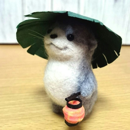

# 달달이봇

<p align="center">
  <a href="" target="blank"></a>
</p>

## 소개

2019년도에 지인이 디스코드에서 원했던 기능 개발을 시작으로 공부 및 재미와 함께 개발한 Final Fantasy XIV 관련 편의 기능 제공 디스코드 봇입니다. 자세한 내용은 [이곳](https://daldaleebot.kr/)에서 확인할 수 있습니다. 

## 기능

* 글로벌, 한국 공식 홈페이지 소식 크롤링을 통한 구독 기능
* 패션체크 조회 및 구독 기능
* XIVAPI 를 통한 아이템 검색 기능
  * 클라이언트 파일 다운로드하여 자체적으로 가공 후 한국어 지원하도록 제공
  * 버전 업데이트 시 자동 갱신
* Universalis 에서 제공하는 시장 가격 조회 기능 (한국도 지원하나 현재 글로벌만 지원)

## 환경

### Backend

* Node.js - v16.14.2
* Nest.js - v10.1.3
* Discord.js - v14.12.1
* Redis - v7.0.9
* MariaDB (MySQL 호환) - v10.11.2
* pm2 - v5.3.0

### Frontend

* React.js - v18
* Ant Design - v4.24.1

## 사용법

`.env` 파일을 통해 봇을 운영할 수 있습니다. `.env.dev` 파일을 참고하여 작성할 수 있습니다.

Discord, Reddit, XIVAPI, Universalis 에서 제공하는 Token 을 발급받아 사용해야 합니다.  

```bash
# 환경 설치
$ npm run init

# 빌드
$ npm run build:linux or build:win

# 실행 (prod)
$ npm run start
# 실행 (.env 에서 모두 참조하는 방식)
$ npm run start:env
# 실행 (dev - backend)
$ npm run start:backend
# 실행 (dev - frontend)
$ npm run start:frontend
```


## 명령어

* `/따라하기 [메세지]` : 봇이 사용자의 말을 똑같이 따라합니다.
* `/상점 [이름]` : 특정 아이템이 판매하는 곳의 정보를 보여줍니다.
* `/소식추가 [언어]` : 현재 디스코드 서버에서 구독 중인 소식 카테고리 중 하나를 추가합니다.
* `/소식삭제 [언어]` : 현재 디스코드 서버에서 구독 중인 소식 카테고리 중 하나를 삭제합니다.
* `/시장 [서버] [아이템이름]` : 현재 시장에 등록되어 있는 특정 아이템의 목록과 이력을 조회합니다. (글로벌 전용)
* `/아이템검색 [이름]` : 아이템을 검색합니다.
* `/업타임` : 디스코드 봇 서버가 시작된 후 경과된 시간을 출력합니다.
* `/제보하기` : 디스코드 봇 개발자에게 의견 또는 건의사항을 전달합니다.
* `/패션체크` : 이번 주의 패션체크를 확인합니다.
* `/패션체크소식등록` : 패션체크 소식을 구독합니다.
